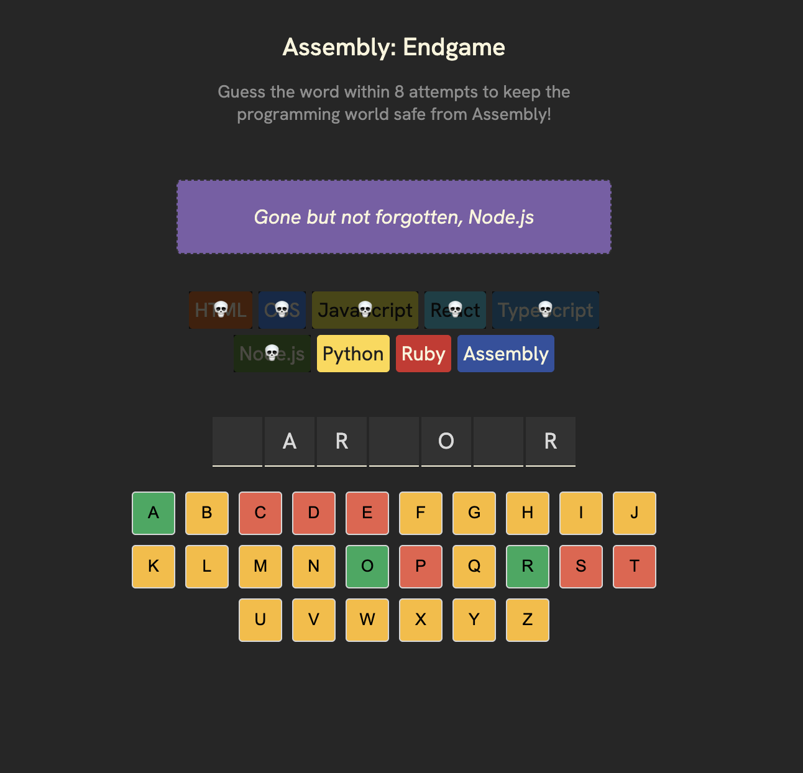

## Coding Game (Typescript)
A modern, accessible word-guessing game built with React and TypeScript. Guess the word within 8 attempts to keep the programming world safe from Assembly!.


The goal of this project is to practice React JS and Conversion of JS code to Typescript.


[ Let's Try in Live :)](https://gmarav05.github.io/ts-game/)

## Video

https://github.com/user-attachments/assets/70e19ebd-92bc-4439-b423-c4c75c9b19a6


## Image

 </br>
 </br>


##  How to Play

1) **Start the Game** - A random word is selected and displayed as blanks.

2) **Guess Letters** - Click on letters to guess the word.

3) **Track Progress** - Watch as programming languages disappear with wrong guesses.

4) **Win or Lose**:

   **Win**: Guess the word before all 8 languages are eliminated. if you win enjoy confetti.

   **Lose**: Run out of attempts and assembly language reamains.

5) **Play Again** - Click "New Game" to start fresh!


## Features

- Accessible Design: Full ARIA support for screen readers and keyboard navigation.

- Word Database: Extensive list of common English words for varied gameplay.

- Built with React and Vite.

- Interactive word-guessing gameplay.

- Visual feedback for eliminated languages.

- It uses Confetti animation on win using `react-confetti`.

- The game has Accessibility features (uses aria-labels)  and keyboard-friendly.

- Deployable to GitHub Pages.

## Learnings

- Learned how to use React JS Hooks like `useState`.

- Practiced building Component-based architecture.

- Practiced some CSS Flexbox styling.

- Practiced more CSS flexbox.


## Live demo

[ View Live  :)](https://gmarav05.github.io/ts-game/)

## Technology Stack

 **Frontend:** HTML5 + CSS + React 19 + TypeScript 5.9 - Type-safe JavaScript for robust code.

 **Build Tool:** Vite.

 **Deployment:** GitHub Pages.

 **Dependencies:** clsx, react-confetti.


## Accessibility Features

- ARIA labels for interactive elements.

- Screen reader-friendly status announcements.

- Semantic HTML structure.


## Project Structure
```
src/
├── App.tsx                    # Main game component and state management
├── main.tsx                   # React entry point
├── index.css                  # Global styles
├── languages.ts               # Programming language data (with colors)
├── utils.ts                   # Helper functions (random selection, farewell text)
├── words.ts                   # Word database for the game
│
└── components/
    ├── ConfettiContainer.tsx  # Celebration effect on win
    ├── Header.tsx             # Game title and description
    ├── GameStatus.tsx         # Win/loss/farewell messages
    ├── LanguageChips.tsx      # Language progress tracker
    ├── WordLetters.tsx        # Hidden word display
    ├── Keyboard.tsx           # Letter guessing buttons
    ├── NewGameButton.tsx      # Restart game button
    └── AriaLiveStatus.tsx     # Screen reader announcements
```    

## Getting Started

### Prerequisites

- Node.js (v16 or higher)
- npm or yarn package manager

## Installation

### Clone the repository
   ```bash
   git clone https://github.com/gmarav05/ts-game.git
   cd ts-game
   ```

### Install dependencies

```sh
npm install
```

### Run locally

```sh
npm run dev
```

### Build for production

```sh
npm run build
```

### Deploy to GitHub Pages

```sh
npm run deploy
```
---

 
